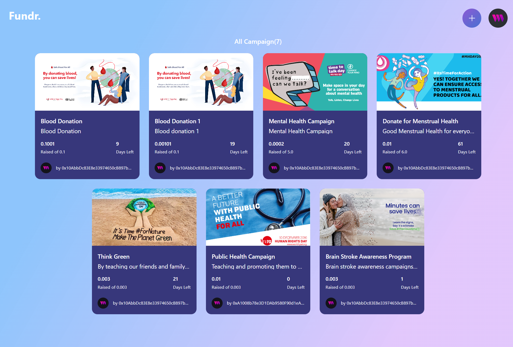
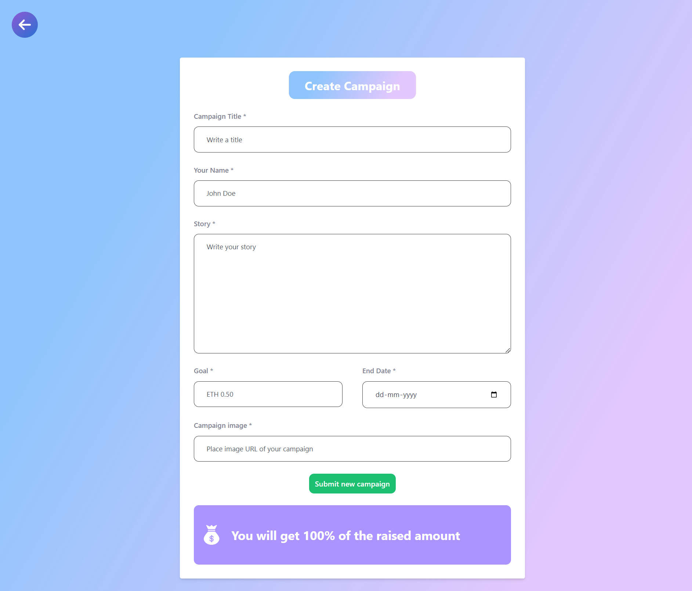

# crowdfunding-dapp
Decentralized Crowdfunding Blockchain app built using Ethereum, Thirdweb, and React.

<!-- put an image in markdown from local files-->

## Project Description

This project is a decentralized crowdfunding application built using Ethereum, Thirdweb, and React. The application allows users to create a crowdfunding campaign and contribute to other crowdfunding campaigns. The application uses a smart contract to store the data and the data is stored on the Ethereum blockchain. The application is built using React and Thirdweb.

## How it works

The application has two main functionalities:

1. Create a crowdfunding campaign
2. Contribute to a crowdfunding campaign

### Create a crowdfunding campaign

To create a crowdfunding campaign, a user has to enter the name of the campaign, the amount of ether to raise, and the description of the campaign.

### Contribute to a crowdfunding campaign

To contribute to a crowdfunding campaign, a user has to enter the address of the campaign and the amount of ether to contribute.

## How to run the application

1. Clone the repository
2. Run `npm install`
3. Run `npm run dev`
4. Open the application on http://localhost:5173/

## Hosted on Vercel

[Link to the Site](https://crowdfunding-dapp-sigma.vercel.app/)

## Resources

- [Ethereum](https://www.ethereum.org/)
- [Thirdweb](https://thirdweb.com/)
- [React](https://reactjs.org/)
- [Solidity](https://solidity.readthedocs.io/en/v0.5.3/)

## Author

- [@jaydeepdey03](https://github.com/jaydeepdey03)
